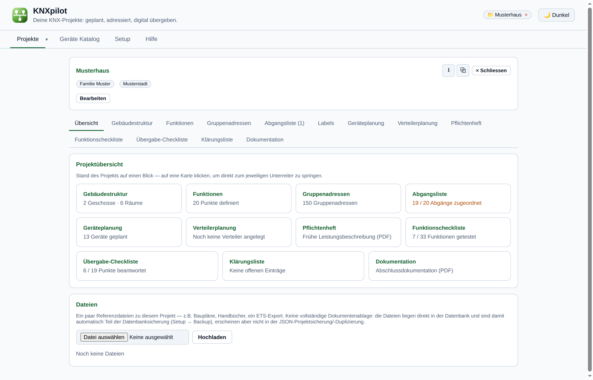
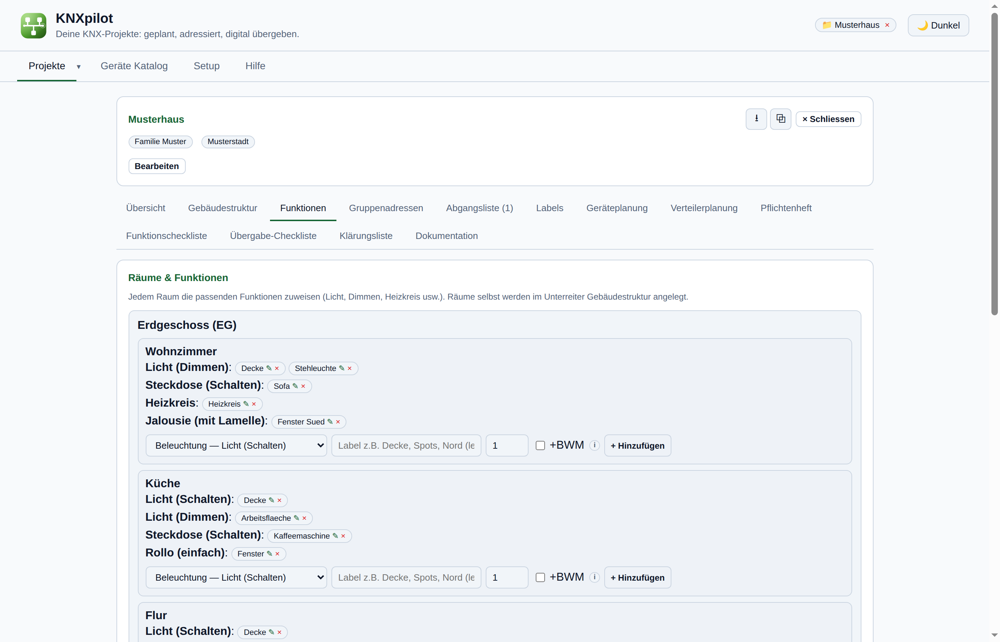
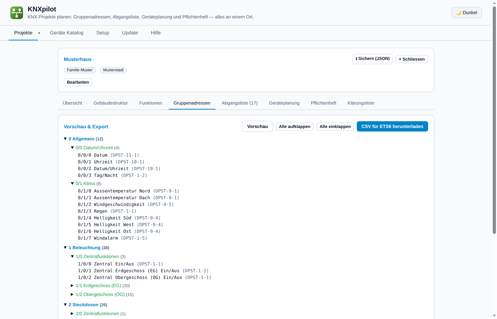
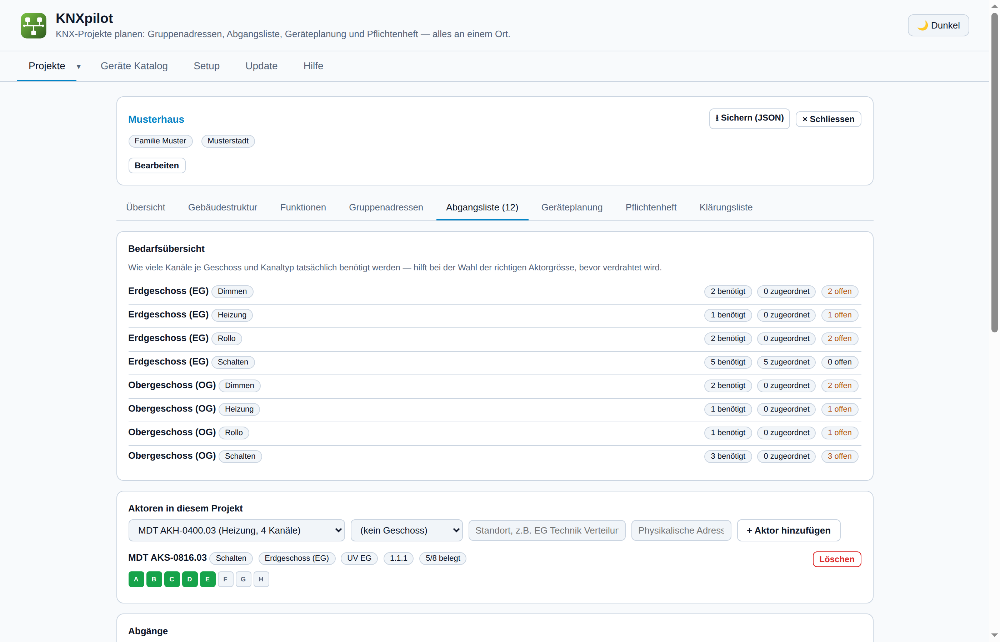

# KNXpilot

Planungswerkzeug für KNX-Installationen, entwickelt anhand echter ETS6-Projekte.
Für Elektriker/Systemintegratoren, die mehrere Projekte parallel planen und dabei
durchgängige Adressierungs- und Namenskonventionen einhalten wollen. Deckt den
Weg von der ersten Raumplanung bis zur fertigen ETS6-Gruppenadressen-CSV, der
Aktoren-Verdrahtungsliste (Abgangsliste), dem digitalen Funktions-/
Übergabe-Check vor Ort und der fertigen Kundendokumentation ab.

**Kernablauf:** Geschosse → Räume → Punkte (Licht / Steckdosen / Fenster /
Heizung) → fertig. Zentral- und Allgemeinfunktionen (Datum/Uhrzeit,
Wetterstation, "alle Lichter aus" je Geschoss usw.) werden automatisch aus
Vorlagen erzeugt.

## Screenshots






## Funktionsumfang

- **Adressierung nach festem Schema** — Hauptgruppe = Funktionskategorie,
  Mittelgruppe = Zentral/je Geschoss, Untergruppe = Adressblock je Punkt,
  mit reservierten `res`-Plätzen für spätere Erweiterung.
- **ETS6-kompatibler CSV-Export/-Import**, byte-genau gegen echte
  ETS6-Exporte geprüft.
- **Abgangsliste** — automatische Kanalzuordnung Aktor ↔ Funktion je
  Geschoss, plus CSV-/PDF-Export für die Schaltschrank-Verdrahtung.
- **Geräteplanung, Pflichtenheft, digitale Checklisten und Klärungsliste**
  — Stückliste, Leistungsbeschreibung, digitaler Funktions-/Übergabe-Check
  vor Ort (kein Papier), interne Rückfragenliste sowie eine
  Abschlussdokumentation am Ende, alle aus denselben Projektdaten.
- **Globaler Gerätekatalog**, mit Startkatalog gängiger KNX-Hersteller
  vorbelegt.
- Einzelbenutzer, **keine Authentifizierung** — für den Betrieb im eigenen
  internen Netzwerk gedacht. Soll das Tool über eine Domain erreichbar
  sein, gehört eine Zugriffskontrolle davor (VPN, oder ein Login via
  Authelia vor einem Reverse Proxy — siehe [`DEPLOYMENT.md`](./DEPLOYMENT.md)),
  nie ungeschützt direkt ans Internet exponieren.

Eine vollständige Bedienungsanleitung (alle Tabs im Detail, Adressierungsmodell,
CSV-Format) ist direkt in der App verfügbar (Tab **Hilfe**) oder hier:
[`MANUAL.md`](./MANUAL.md).

## Schnellstart

**Voraussetzungen:** Docker mit Compose-Plugin, sowie `git`.

```bash
git clone https://github.com/seaspotter/knxpilot.git
cd knxpilot
docker compose pull
docker compose up -d
```

Danach `http://<host>` öffnen (läuft auf Port 80, kein `:8000` nötig).

**Beim ersten Start** sind Kategorien, Funktionstypen, Zentral-/
Allgemeinfunktions-Vorlagen sowie der Geräte-Katalog bereits mit sinnvollen
Standardwerten vorbelegt.

## Weiterführende Dokumentation

- [`MANUAL.md`](./MANUAL.md) — vollständige Bedienungsanleitung (auch als
  Hilfe-Tab in der App)
- [`DEVELOPMENT.md`](./DEVELOPMENT.md) — lokales Setup, Projektstruktur,
  Branch-Workflow
- [`DEPLOYMENT.md`](./DEPLOYMENT.md) — Persistenz, Self-Update-Mechanismus,
  Proxmox/LXC-Bereitstellung
- [`CHANGELOG.md`](./CHANGELOG.md) — Änderungen über die Zeit
- [`ROADMAP.md`](./ROADMAP.md) — geplante/angedachte zukünftige Funktionen

## Lizenz

GNU Affero General Public License v3.0 or later (AGPL-3.0-or-later) — siehe
[`LICENSE`](./LICENSE). Bewusst gewählt, weil dies ein Netzwerkdienst ist
(eine Webanwendung): AGPL schliesst die "SaaS-Lücke", die die einfache GPL
hat — betreibt jemand eine geänderte Version dieses Tools als gehosteten
Dienst, muss der geänderte Quellcode auch dessen Nutzern zur Verfügung
gestellt werden, nicht nur jenen, denen eine Kopie ausgehändigt wird.

Vor einer Veröffentlichung "the project author(s)" im Lizenz-Header am
Anfang von `backend/main.py` durch den tatsächlichen Namen bzw. die Firma
ersetzen.
